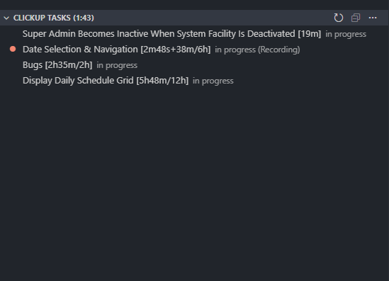

# ClickUp Tasks VS Code Extension

A VS Code extension that displays your ClickUp in-progress tasks directly in the Source Control panel, right next to your Git changes.



## Features

- **View In-Progress Tasks** - See all your in-progress ClickUp tasks directly in the Source Control panel
- **Time Tracking** - Start and stop time tracking for tasks directly from VS Code
- **Visual Indicators** - Currently tracked tasks are highlighted with a red circle icon and "(Recording)" label
- **Time Display** - View tracked time and time estimates in a readable format (e.g., `[3h23m/5h]`)
- **Auto-Refresh** - Automatically refresh tasks every 5 minutes with a countdown timer in the view title
- **Copy Task ID** - Click any task to copy its ID in `CU-{taskId}` format to your clipboard
- **Open in ClickUp** - Right-click tasks to open them in your browser
- **Easy Configuration** - Configure through VS Code settings or command palette
- **Custom Status Support** - Configure which statuses count as "in-progress" for your workspace
- **Status Display** - See task status and other details in tooltips
- **Multi-Team Support** - Configure Team ID for workspaces with multiple teams
- **Manual Refresh** - Refresh button in the view toolbar for on-demand updates

## Setup

### 1. Get Your ClickUp API Token

1. Go to [ClickUp Settings > Apps > API](https://app.clickup.com/settings/apps)
2. Generate or copy your API token
3. The token should look like `pk_xxxxx...`

### 2. Install the Extension Locally

1. **Install dependencies:**
   ```bash
   npm install
   ```

2. **Compile the extension:**
   ```bash
   npm run compile
   ```

3. **Package the extension:**
   ```bash
   npx @vscode/vsce package --baseContentUrl https://github.com --baseImagesUrl https://github.com
   ```
   This creates a `.vsix` file (e.g., `clickup-tasks-0.0.1.vsix`) in the current directory.

4. **Install the extension:**
   - Open VS Code
   - Go to Extensions (Ctrl+Shift+X)
   - Click the `...` menu at the top of the Extensions panel
   - Select "Install from VSIX..."
   - Choose the generated `.vsix` file
   - Reload VS Code when prompted

### 3. Configure

1. Open Command Palette (Ctrl+Shift+P)
2. Run "ClickUp Tasks: Configure ClickUp API"
3. Enter your API token
4. (Optional) Set your Team ID in settings if you have multiple teams

Alternatively, you can configure it in VS Code settings:
- Open Settings (Ctrl+,)
- Search for "ClickUp Tasks"
- Enter your API token and optional Team ID

## Usage

1. Open the Source Control panel (Ctrl+Shift+G)
2. You'll see a new "ClickUp Tasks" view at the bottom
3. Click any task to open it in ClickUp
4. Use the refresh button to manually refresh tasks

## Configuration Options

- `clickupTasks.apiToken`: Your ClickUp API token (required)
- `clickupTasks.teamId`: Your ClickUp Team ID (optional, uses first team if not specified)
- `clickupTasks.autoRefresh`: Automatically refresh tasks every 5 minutes (default: true)

## Development

### Quick Start

1. **Install dependencies:**
   ```bash
   npm install
   ```

2. **Press F5** to launch the Extension Development Host
   - This automatically starts the TypeScript watch task
   - A new VS Code window will open with your extension loaded

### Live Reload Workflow

The extension has **semi-automatic reload**:

1. **TypeScript auto-compiles** - The watch task runs in the background and automatically compiles your TypeScript changes
2. **Reload the Extension Host** - After making code changes:
   - Press **Ctrl+R** (or **Cmd+R** on Mac) in the Extension Development Host window
   - Or use Command Palette → "Developer: Reload Window"

**Workflow:**
- Make code changes → TypeScript auto-compiles → Press Ctrl+R in Extension Host → See changes!

### Manual Commands

```bash
# Compile once
npm run compile

# Watch for changes (auto-compiles on save)
npm run watch
```

## License

MIT

